# Deep Agent Architectural Review & Documentation

## 1. End-To-End Architecture Diagram

This diagram maps the complete lifecycle of a user query through the system, detailing the interactions between the UI, the Orchestrator, the Event Bus, Tools, Sandbox, and Sub-agents.

```mermaid
sequenceDiagram
    participant User as User / UI
    participant ChatAPI as chat.py (API)
    participant Bus as EventBus (bus.py)
    participant Agent as Deep Agent (deep_agent.py)
    participant Registry as Skill Registry
    participant Tools as Tools (DuckDB, Python)
    participant Sandbox as Python Sandbox

    User->>ChatAPI: POST /chat { message, model }
    ChatAPI->>Bus: get_event_bus().get_queue(session_id)
    Note over ChatAPI, Agent: Background Task Spawned
    ChatAPI->>Agent: get_deep_agent().invoke(message)
    ChatAPI-->>User: SSE Connection Opened

    rect rgb(30, 41, 59)
    Note over Agent, Sandbox: Agent Execution Loop (LangGraph)
    
    Agent->>Registry: Inject Catalog into System Prompt
    Agent->>Agent: LLM considers System Prompt + Context
    Agent->>Bus: emit(AgentEvent(type="progress", status="running", label="Thinking..."))
    Bus-->>User: SSE Event [UI shows Spinner]
    
    Agent->>Agent: LLM yields Tool Call(s) (e.g., load_skill, query_duckdb)
    
    Agent->>Bus: emit(AgentEvent(type="tool_start", tool=..., args=...))
    Bus-->>User: SSE Event [UI: "Running Python..."]
    
    alt is run_python
        Agent->>Tools: run_python(code)
        Tools->>Sandbox: execute_python(subprocess)
        Sandbox-->>Tools: SandboxResult (stdout, charts, tables)
        Tools->>Bus: emit(AgentEvent(type="artifact", data=chart))
        Bus-->>User: SSE Event [UI parses Vega-lite/HTML and renders Artifact]
    else is load_skill
        Agent->>Tools: load_skill("altair_charts")
        Tools->>Registry: load SKILL.md
        Registry-->>Tools: Markdown content
    end
    
    Tools-->>Agent: ToolMessage (String Output)
    Agent->>Bus: emit(AgentEvent(type="tool_end", result_preview=...))
    Bus-->>User: SSE Event [UI updates tool status to Done]
    
    Agent->>Agent: Iterates loop with new ToolMessage contexts
    end

    Agent->>Agent: LLM yields Text Response
    Agent->>Bus: emit(AgentEvent(type="message", content="Here is the chart..."))
    Bus-->>User: SSE Event [UI streams markdown text]
    
    Agent->>Bus: emit(AgentEvent(type="done"))
    Bus-->>User: SSE Event [Connection Closed]
```

---

## 2. Step-by-Step Analysis & Literature Review

### Step A: API Ingestion & Streaming Setup (`chat.py` & `bus.py`)
**How it currently works**: `chat.py` accepts the HTTP request, initializes an `EventBus` for the session, and spawns the LangGraph agent in an asyncio background task. An `EventSourceResponse` (SSE) consumes events from the bus and streams them to the user.
**Literature Review (Industry Standard)**: The industry standard for AI inference is indeed Server-Sent Events (SSE) or WebSockets. LangChain's native `astream_events` is often used, but custom EventBus patterns (like yours) are heavily favored in complex systems (e.g., AutoGen, OpenAI Assistants API) because they decouple the LLM inference loop from the network layer and allow out-of-band events (like artifacts generated inside tools).
**Hardening & Improvements**:
- **Hardening**: Add proper queue timeout controls and backpressure handling. If the client disconnects silently, the background agent task must be cancelled to prevent compute waste (`asyncio.CancelledError` catching).
- **Transparency**: Right now, the A2UI message simply says "Thinking...". We can improve this by using the LLM's streaming tokens natively. If the model supports `<think>` tags (like DeepSeek R1), we can stream the actual raw thought process to the UI in a collapsible "Chain of Thought" panel, rather than just a generic progress bar.

### Step B: System Prompt Construction & Context Alignment (`deep_agent.py`)
**How it currently works**: The system prompt is constructed dynamically by reading `system_prompt.md`, fetching DuckDB schema limits (`_get_data_context()`), and dynamically injecting the Skill Catalog via `registry.py`.
**Literature Review (Industry Standard)**: Dynamic context injection (RAG for schemas) is standard. "Agentic" architectures are increasingly moving away from massive static prompts to "Just-in-Time" instructions. Your `load_skill` approach is essentially what the industry calls "Tool / Skill Retrieval" — deferring token usage until the skill is actually needed.
**Efficiency**:
- The prompt includes the first 5 rows of every dataset. If the database scales to 50+ tables, this will blow up the context window.
**Improvements**:
- **Semantic Schema Search**: Instead of dumping all schemas, provide a tool `search_tables(query)` and only inject schemas relevant to the user's prompt.
- **Dynamic Few-Shot**: Before adding the skill catalog, search past successful traces (using embeddings) and inject one successful example of how prior agents solved a similar query.

### Step C: The Agent Execution Loop (LangGraph `CompiledStateGraph`)
**How it currently works**: The agent operates in a React (Reason-Only-Act) loop. It is wrapped in two critical middlewares: `EventBusMiddleware` (which intercepts tool calls to emit UI progress) and `ToolResultCompactionMiddleware` (which summarizes old tool outputs to save context window).
**Literature Review (Industry Standard)**: 
- *Context Compaction*: Anthropic and OpenAI research show that LLMs "lose the plot" after ~10-15 tool calls due to context bloat. Your compaction middleware is highly aligned with current state-of-the-art memory management (e.g., MemGPT). 
- *Multi-agent (Delegation)*: When `mode="multi"`, the Orchestrator delegates to sub-agents (`data_profiler`, `visualizer`). Hierarchical delegation is standard (Microsoft AutoGen, CrewAI), but often suffers from "communication loss" where the sub-agent lacks the global context.
**Hardening**:
- **Loop Prevention**: Implement a strict "repeated action" detector. If the agent calls the same tool with the exact same arguments twice and gets the same error twice, forcefully halt execution and ask the user for help.
- **Better Transparency**: Agents should output a structured "Plan" before acting. The `write_todos` tool is a good start, but it relies on prompt compliance. The network should enforce a schema: every internal step must generate a JSON containing `{"thought": "...", "next_tool": "..."}`, and the UI should render the `thought` field directly to the user as "Agent Log".

### Step D: Sandboxed Tool Execution (`run_python` & `sandbox/executor.py`)
**How it currently works**: The `run_python` tool sanitizes code via AST, appends a runner script (`RUNNER_TEMPLATE`), executes it in a true OS subprocess, parses `stdout` for a JSON artifact block, and converts matched charts/tables into `Artifact` records saved via `store.add_artifact()`.
**Literature Review (Industry Standard)**: This mirrors OpenAI's Advanced Data Analysis (formerly Code Interpreter), which executes Python in a secure gVisor sandbox. Using a local subprocess for an OSS project is standard, but highly insecure if exposed to the public internet because local OS subprocesses can read host files (despite `os.environ` cleaning).
**Hardening**:
- **Docker/WASM Isolation**: To truly harden this, Python execution must be moved inside a distinct Docker container or a WebAssembly (Pyodide) runtime. 
- **Timeouts & OOMs**: The current timeout relies on `subprocess.run(timeout=...)`. Python processes can bypass process-level timeouts if they deadlock in C-extensions. Resource limits (ulimit for RAM/CPU) must be enforced to prevent the LLM from writing an infinite while-loop that crashes the backend host.
**Improving Analysis Outcomes**:
- Implement an **Auto-Reflexion** loop locally within the tool: If the sandbox throws an exception (e.g., `KeyError`), `execute_python` should automatically retry via a smaller internal LLM sub-call to fix syntax before returning the giant error string to the main Orchestrator. This saves massive context tokens and wall-clock latency.

### Step E: Agent-to-UI Rendering (Frontend Integration)
**How it currently works**: The backend streams SSE to React. The React frontend maintains a localized state machine. Charts (`vega-lite`), diagrams (`mermaid`), and tables (`html`) are intercepted and stored in a shared Zustand store, enabling them to be rendered both inline in chat and persistently in an "Artifacts" side-panel.
**Literature Review (Industry Standard)**: This is identical to Anthropic Claude's "Artifacts" UI paradigm — isolating ephemeral chat text from persistent, interactive documents. 
**UI Enhancements & Transparency**:
- **Step-by-Step Visualization**: Allow users to click on intermediate tool steps in the UI to see the exact Python code the agent ran and the raw output, instead of just seeing "Running Python...".
- **Human-in-the-Loop (HitL)**: Introduce a frontend element where, if the agent requires clarification before running a destructive Sandbox query, it drops a UI "Approval" widget into the chat stream instead of just text, parsing a `requires_approval` flag from the A2UI event.
- **Polished Agent Messaging**: The final message is currently generated while the agent is "done" thinking. To ensure the message is polished, we can route the final text through a lightweight formatting pipeline (a fast LLM like groq/llama3-8b) specifically instructed to transform raw analyst notes into polished, executive-friendly summaries, ensuring the agent uses bullet points and professional wording without bloating the core analytical agent's context.

---

## 3. End-to-End System Evaluation Checklist

If a full evaluation rubric is needed to grade this architecture, it should be tested against:
1. **Latency overhead**: Time from tool return to SSE emission (Target: < 20ms).
2. **Context bloat**: Number of tokens consumed by the context truncator per 10 loops.
3. **Artifact Integrity**: Guarantee that an artifact generated in the sandbox arrives structurally intact at the React client.
4. **Resilience**: Agent recovery rate from sandbox KeyErrors (Currently relies on LLM prompt obedience, should be shifted to procedural retries).

---

## 4. Full Enhancement Plan & Impact Analysis

Building upon the initial review, this section details concrete architectural enhancements for the core pillars of the Deep Agent system. For each area, multiple solutions are proposed with pros/cons, followed by a systemic "chain impact" evaluation dictating how the change flows from User to UI.

### Pillar A: System Prompt & Context Alignment
*Goal: Prevent context bloat as datasets and skills scale, while ensuring the agent always has the precise table schemas it needs.*

> **Note on RAG**: *Per user requirement, semantic search and Vector-based RAG are explicitly excluded from this project. We will not use embeddings to fetch schemas, but rather rely on deterministic LLM routing to select exact context.*

#### Solution A1: Router-to-Specialist Agent Architecture
Instead of a monolithic prompt, user queries hit a lightweight `Router_LLM`. The router responds with JSON indicating exactly which tables and skills are needed. The main Orchestrator is then booted with only those specific contexts.
- **Pros**: Highly accurate. LLM routing understands logic better than primitive vector math. Needs no vector DB infrastructure.
- **Cons**: Adds a blocking network hop (latency +1000ms) before the UI even shows "Thinking...".

#### Recommended Selection & End-to-End Chain Impact (A1)
**Selection**: **A1 (Router Agent)** is vastly superior for analytical chatbots where schema precision is non-negotiable and RAG is explicitly disabled.
**Chain Impact**:
1. **User**: Types query.
2. **ChatAPI**: Intercepts query, calls fast Groq/Llama3 model just for routing. 
3. **EventBus**: Emits new `router_running` event.
4. **UI**: Shows exactly what the router decided: "Identified need for 'sales_db' and 'altair_charts'".
5. **Orchestrator**: Boots with a lean, highly specific context window. This drastically reduces hallucination rates in the downstream `query_duckdb` tool.

---

### Pillar B: Sandboxed Execution & Reliability
*Goal: Fix the frequent loop of "LLM writes bad code -> Sandbox throws KeyError -> LLM tries again" which burns tokens and user patience.*

#### Solution B1: "Auto-Reflexion" Local Retry Loop
Inside the `run_python` tool itself, if a `subprocess` throws an exception, intercept the trace and use a small, fast local LLM (e.g., GPT-4o-mini) with a single static prompt: "Fix this Python syntax/Key error". The tool retries up to 3 times entirely natively before returning the final result to the Orchestrator.
- **Pros**: Hides ugly retry loops from the main Orchestrator, saving massive tokens. Transparent to the UI.
- **Cons**: Masks context from the Orchestrator. The Main LLM won't learn *why* its code was wrong.

#### Solution B2: Shift Execution to Frontend (Pyodide / WASM)
Send the raw Python string to the React UI via SSE, and execute the sandbox entirely in the user's browser using Pyodide + local DuckDB-WASM.
- **Pros**: Zero backend compute cost. Absolute security (client runs their own code). Instant UI rendering.
- **Cons**: Massive initial page-load payload (~30MB for Pyodide). Browser memory constraints will crash on datasets larger than 500MB.

#### Recommended Selection & End-to-End Chain Impact (B1)
**Selection**: **B1 (Auto-Reflexion)** maintains the power of backend compute while fixing token bloat.
**Chain Impact**:
1. **Orchestrator**: Yields Python code.
2. **EventBus**: Emits `tool_start` (run_python).
3. **Tools/Sandbox**: Code fails. Tool blocks, triggers fast-LLM repair, succeeds on attempt 2.
4. **EventBus**: Emits `tool_retry` to UI (so user knows it auto-corrected).
5. **UI**: Modifies the progress step: "Running Python (Auto-corrected KeyError)".
6. **Orchestrator**: Receives only the successful output, unaware of the failure.

---

### Pillar C: Agent-to-UI Transparency (The "Black Box" Problem)
*Goal: Give users extreme visibility into "What is the agent actually thinking?"*

#### Solution C1: Native Chain-of-Thought (CoT) Streaming
Force the agent to output raw thoughts in `<think> ... </think>` tags before yielding the tool. Parse these tags via the EventBus and stream them.
- **Pros**: Maximum transparency. The user sees the literal neural network reasoning.
- **Cons**: Requires native model support (DeepSeek R1 does this natively, GPT-4 does not). Can look messy to non-technical users.

#### Solution C2: Mandated JSON Planning Format
Force the Orchestrator to always return `{"thought_process": "...", "action": {"name": "run_python", ...}}`.
- **Pros**: Model agnostic. Clean structured data.
- **Cons**: Hard to stream JSON progressively. Adds delay before the tool actually fires.

#### Recommended Selection & End-to-End Chain Impact (C1 - simulated if necessary)
**Selection**: **C1**, simulated via a custom Langchain Output Parser if the model doesn't support `<think>` natively.
**Chain Impact**:
1. **Orchestrator**: Starts generating tokens. 
2. **EventBus Middleware**: Intercepts tokens. If inside a `<think>` block, emits `AgentEvent(type="thought_stream", delta="...")`.
3. **UI**: Drops a sleek, collapsible Accordion component titled "Agent Thought Process". Text streams in real-time.
4. **Trust Factor**: User trust skyrockets because they can read the logic *while* waiting for the code to run.

---

### Pillar D: Polished Messaging & Analysis Outcome
*Goal: Ensure the final text sent to the user is professional, well-formatted, and not bloated with internal agent jargon.*

#### Solution D1: End-of-Line Synthesis Pipeline
Once the Orchestrator yields its final response, intercept the text. Send the raw query, the charts, and the Draft Response to a final "Polish LLM" with strict instructions: "Convert this to an executive summary with bullet points."
- **Pros**: Guaranteed beautiful formatting. The analytical agent can focus purely on code and math, not spelling/tone.
- **Cons**: Adds a 2-second delay at the very end of the interaction.

#### Solution D3: Parallel Local Pipeline (IMPLEMENTED)
When a worker sub-agent (e.g., `visualizer` or `sql_analyst`) finishes, `deep_agent.py` intercepts its raw return text via `EventBusMiddleware`. Instead of blocking, it spawns an `asyncio` task that pipes this text to a fast local model (`qwen3.5:9b` via Ollama) inside `app/llm/polisher.py`. The local LLM streams a beautifully formatted rewrite directly to the UI (`subagent_update` event), while the Orchestrator simultaneously moves on to its next step.
- **Pros**: Zero latency impact on the main framework. Complete transparency into the "actual agent doing the work." Real-time streaming.
- **Cons**: Requires a secondary lightweight model running locally.

#### Recommended Selection & End-to-End Chain Impact (D3)
**Selection**: **D3 (Parallel Local Pipeline) has been implemented.**
**Chain Impact**:
1. **Sub-agent**: Worker completes its graph state and returns a massive technical summary (raw markdown).
2. **Middleware**: `EventBusMiddleware` intercepts the return value. Dispatches a fire-and-forget `asyncio.create_task()` to `polisher.py`.
3. **Orchestrator**: Instantly receives the raw text and continues its LangGraph processing at full speed.
4. **Polisher (`qwen3.5:9b`)**: Streams an executive-level summary of the sub-agent's work over the SSE connection.
5. **UI**: React (`chatStore.ts`) catches the parallel stream (`subagent_update`) and renders a distinct, colored `SubagentBubble` inside the message list in real-time.
